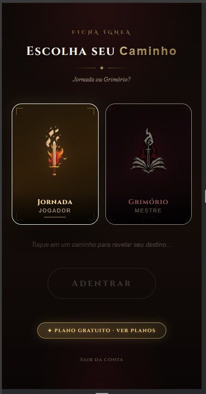
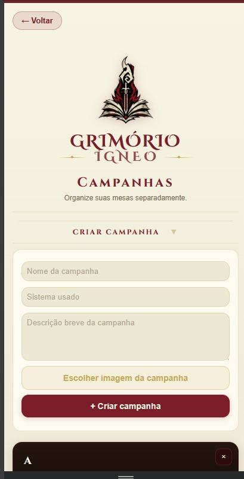
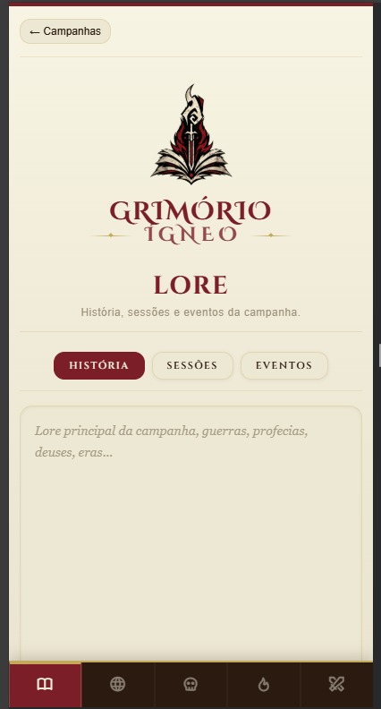
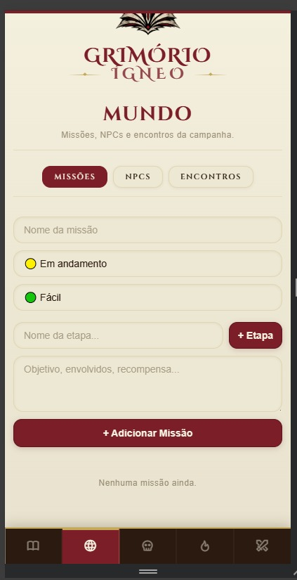
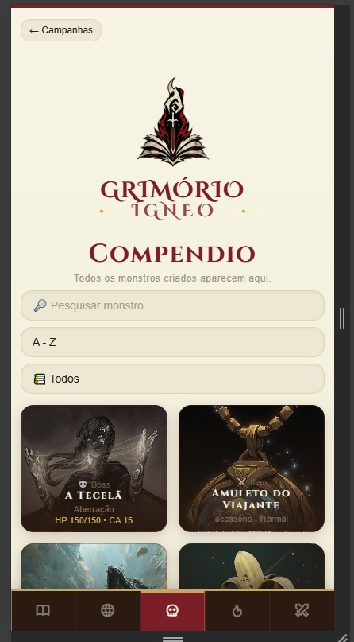
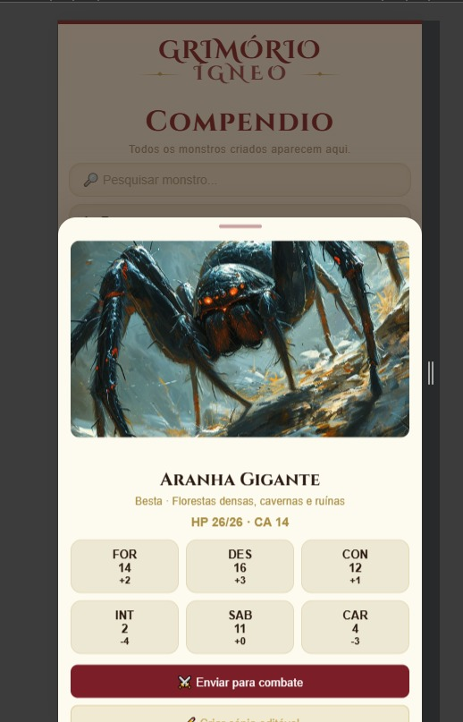
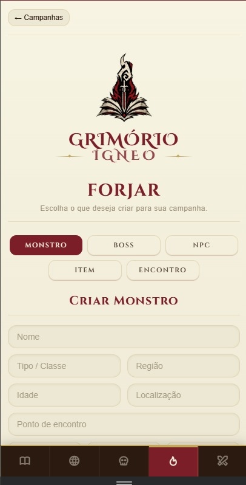
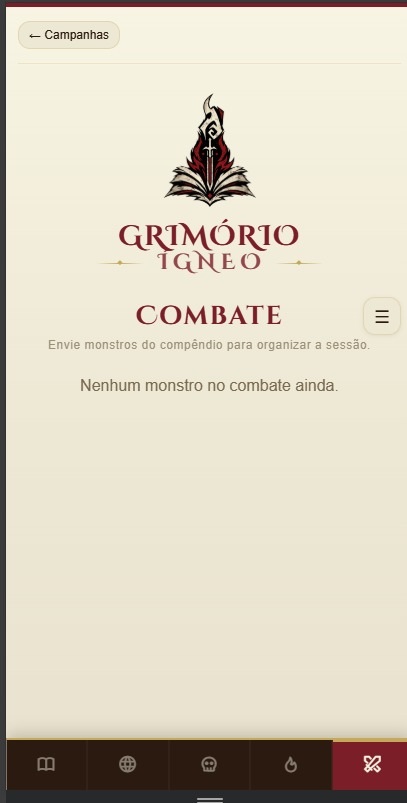
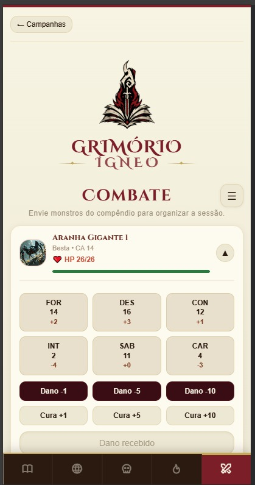
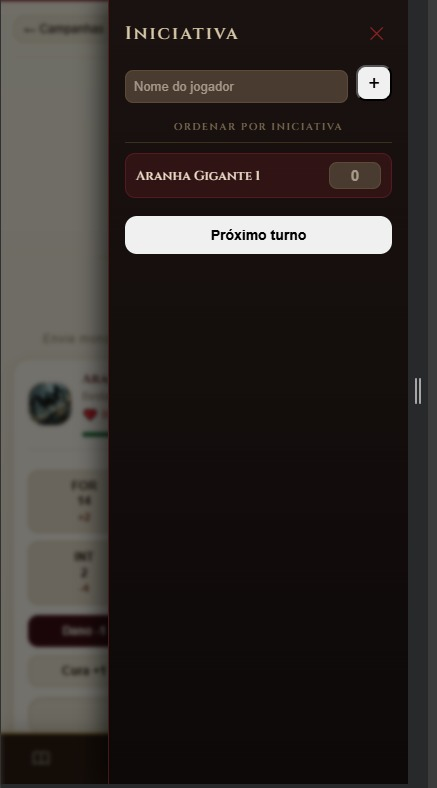

# 🔥 Ficha Ígnea

**A ficha de RPG digital que nasceu numa mesa de amigos — e cresceu para o mundo**

[](https://lonnar17.github.io/app-ficha-ignea/)
[](#-android--google-play-store)
[](#-pwa--instalação-como-aplicativo)
[](LICENSE)
[](#-tecnologias)

</div>

---

## 📋 Índice

- [A História do Projeto](#-a-história-do-projeto)
- [Demo](#-demo)
- [Preview](#-preview)
- [Modos do App](#-modos-do-app)
  - [Jornada — Modo Jogador](#-jornada--modo-jogador)
  - [Grimório — Modo Mestre](#-grimório--modo-mestre)
- [Funcionalidades — Jornada](#%EF%B8%8F-funcionalidades--jornada)
  - [Personagem](#-personagem)
  - [Atributos e Perícias](#-atributos-e-perícias)
  - [Combate](#%EF%B8%8F-combate)
  - [Inventário](#-inventário)
  - [Poderes e Magias](#-poderes-e-magias)
- [Funcionalidades — Grimório](#-funcionalidades--grimório)
  - [Campanhas](#-campanhas)
  - [Lore](#-lore)
  - [Mundo](#-mundo)
  - [Compêndio](#-compêndio)
  - [Forjar](#-forjar)
  - [Combate do Mestre](#%EF%B8%8F-combate-do-mestre)
  - [Iniciativa](#-iniciativa)
- [Raças Disponíveis](#-raças-disponíveis)
- [Tipos de Dano](#-tipos-de-dano)
- [Tecnologias](#%EF%B8%8F-tecnologias)
- [Estrutura do Projeto](#-estrutura-do-projeto)
- [Como Usar](#%EF%B8%8F-como-usar)
- [PWA — Instalação como Aplicativo](#-pwa--instalação-como-aplicativo)
- [Android — Google Play Store](#-android--google-play-store)
- [Armazenamento de Dados](#-armazenamento-de-dados)
- [Exportar e Importar Personagens](#-exportar-e-importar-personagens)
- [Roadmap](#-roadmap)
- [Contribuindo](#-contribuindo)
- [Licença](#-licença)
- [Autor](#-autor)

---

## 📖 A História do Projeto

O **Ficha Ígnea** nasceu de uma necessidade bem simples: alguns amigos queriam jogar D&D 5e, mas tinham dificuldade em entender as fichas de papel — modificadores, perícias, salvaguardas, tudo aquilo que pode parecer intimidador para quem está começando.

A solução inicial foi criar algo só para a mesa — um app pessoal, sem pretensões, apenas para facilitar a vida dos amigos durante as sessões. Com o tempo, o projeto foi crescendo, ganhando novas funcionalidades, sendo refinado sessão após sessão, até se tornar o que é hoje: **uma plataforma completa de gerenciamento de RPG**, com modo para jogadores (Jornada) e modo para o Mestre (Grimório).

Hoje o Ficha Ígnea é uma **Progressive Web App** moderna, instalável no celular e no computador, com suporte a múltiplos personagens, campanhas, compêndio de monstros e itens, sistema de combate para o mestre e muito mais — mantendo sempre o espírito de ser acessível para todo tipo de jogador.

| Problema comum | Solução do Ficha Ígnea |
|---|---|
| Ficha de papel se perde ou danifica | Dados salvos localmente e exportáveis |
| Apps limitados ou pagos | Versão gratuita completa |
| Dificuldade de uso no celular | Interface mobile-first e responsiva |
| Amigos iniciantes com dificuldade na ficha | Cálculos automáticos e interface intuitiva |
| Mestre sem ferramenta para gerenciar sessões | Modo Grimório com compêndio e combate |
| Dependência de internet | Funciona offline via PWA |

---

## 🚀 Demo

Acesse a versão online sem instalar nada:

**👉 [https://lonnar17.github.io/app-ficha-ignea/](https://lonnar17.github.io/app-ficha-ignea/)**

---

## 📸 Preview

### Tela Inicial & Seleção de Caminho

<p align="center">
  
</p>

### Modo Jornada — Ficha do Jogador

<p align="center">
  
  
  
</p>

<p align="center">
  
  
  
</p>

### Modo Grimório — Ferramentas do Mestre

<p align="center">
  
  
  
</p>

<p align="center">
  
  
  
</p>

<p align="center">
  
  
  
</p>

---

## 🗺️ Modos do App

Na tela inicial, o usuário escolhe entre dois caminhos:

### 🕯️ Jornada — Modo Jogador

Acesso à ficha completa do personagem. Tudo que um jogador precisa para gerenciar seu herói durante uma aventura: atributos, combate, inventário, poderes e muito mais.

### 📖 Grimório — Modo Mestre

Ferramentas completas para o Mestre de Jogo organizar e conduzir suas campanhas: criação de campanhas, lore, missões, NPCs, compêndio de criaturas e itens, combate e sistema de iniciativa.

---

## ⚔️ Funcionalidades — Jornada

### 👤 Personagem

A aba de personagem centraliza tudo que define a identidade do herói:

- **Informações básicas** — nome, classe, raça, idade, altura e antecedente
- **Nível de 1 a 20** — ou valor customizado para sistemas alternativos
- **Upload de imagem do personagem** — envie uma ilustração ou foto; o editor de posicionamento (pan) permite ajustar o enquadramento dentro do card
- **12 raças predefinidas** com possibilidade de criar raças completamente personalizadas (veja a seção [Raças Disponíveis](#-raças-disponíveis))
- **Idiomas** — campo livre para registrar línguas conhecidas pelo personagem
- **Sistema de Aliados** — cadastre NPCs aliados com nome, localização e descrição; útil para acompanhar relações construídas ao longo da campanha

---

### 📊 Atributos e Perícias

Gerenciamento completo das estatísticas do personagem, com cálculos automáticos para facilitar a vida de jogadores iniciantes:

- **6 atributos principais** com modificadores calculados automaticamente:
  - Força (FOR), Destreza (DES), Constituição (CON), Inteligência (INT), Sabedoria (SAB), Carisma (CAR)
- **Bônus de proficiência** — ajustável manualmente; usado em todos os cálculos automáticos de perícias e salvaguardas
- **Inspiração** — contador de uso de inspiração
- **18 perícias** com toggle de proficiência individual (modificadores calculados automaticamente):

| Coluna 1 | Coluna 2 | Coluna 3 |
|---|---|---|
| Acrobacia | Furtividade | Medicina |
| Arcanismo | História | Natureza |
| Atletismo | Intimidação | Percepção |
| Atuação | Intuição | Persuasão |
| Enganação | Investigação | Prestidigitação |
| Lidar c/ Animais | Religião | Sobrevivência |

- **Salvaguardas** — calculadas automaticamente a partir dos atributos e proficiências marcadas
- **Proficiências extras** — campo livre para armas, armaduras, ferramentas e idiomas adicionais

---

### ⚔️ Combate

Controle total da situação de batalha, com interface visual interativa:

- **Sistema de HP completo**:
  - Vida Máxima configurável
  - Vida Atual com barra de progresso visual (muda de cor conforme a vida cai)
  - Vida Temporária com barra separada
  - Total de vida (atual + temporária) exibido em destaque
- **CA (Classe de Armadura)** e **Deslocamento** em campos editáveis
- **Armas** — cadastre quantas quiser com:
  - Nome da arma
  - Dado de dano (ex: `2d6+3`)
  - Descrição e lore da arma
  - Cargas (opcional) — checkboxes para rastrear usos limitados
- **Armaduras** — cadastre com nome, valor de CA, descrição e cargas opcionais
- **Exaustão** — 7 níveis com descrição automática dos efeitos de cada nível (D&D 5e oficial)
- **Pontos de Morte** — rastreamento de sucessos e falhas (3 de cada) com visual de checkboxes
- **Pontos de Domínio** — 6 checkboxes configuráveis para habilidades com usos limitados
- **Resistências e Imunidades** — campo livre para registrar resistências a tipos de dano

---

### 🎒 Inventário

Gestão completa de equipamentos com funcionalidades avançadas:

- **Cadastro de itens** com nome, quantidade e descrição
- **Sistema de Sintonização** — toggle para itens que exigem sintonização mágica; o app rastreia quantos itens sintonizados o personagem possui
- **Reordenação por arrastar** — reorganize a ordem dos itens da forma que preferir
- **Edição via popup** — edite qualquer item sem sair da tela de inventário
- **Diário integrado** — campo de texto livre para anotações de campanha: missões, NPCs importantes, segredos descobertos, pontos de trama, notas pessoais do personagem

---

### 🔥 Poderes e Magias

Sistema completo para habilidades mágicas, divinas e especiais:

- **DT (Dificuldade de Teste de Magia)**:
  - Base configurável
  - Modificador do atributo conjurador
  - Bônus de proficiência
  - Total calculado automaticamente
- **Poderes** — habilidades especiais e de classe com:
  - Nome e dado de dano
  - Tipo de dano (com identificação visual)
  - Descrição completa
  - Número de usos rastreável
- **Magias por círculo (0 a 9)**:
  - Espaços de magia editáveis por círculo
  - Cada magia inclui: nome, tipo, dano, círculo, tempo de conjuração, alcance, duração, descrição e número de usos
  - Organização visual por círculo

**21 tipos de dano disponíveis:**

| Tipo | Emoji | Tipo | Emoji | Tipo | Emoji |
|------|-------|------|-------|------|-------|
| Fogo | 🔥 | Raio | ⚡ | Trovejante | 🌩️ |
| Gelo | ❄️ | Necrótico | 💀 | Radiante | ✨ |
| Veneno | ☠️ | Água | 💧 | Mágico | 🔮 |
| Psíquico | 🧠 | Corte | 🗡️ | Perfurante | 🏹 |
| Concussão | 💥 | Metal | ⚙️ | Físico | 👊 |
| Vento | 🌬️ | Madeira | 🪵 | Terra | 🪨 |
| Trevas | 🌑 | Luz | 🌟 | Espírito | 👻 |

---

## 📚 Funcionalidades — Grimório

### 🏰 Campanhas

O ponto de entrada do Grimório. O mestre pode gerenciar múltiplas campanhas separadamente:

- Criar campanhas com nome, sistema utilizado e descrição
- Adicionar imagem de capa para cada campanha
- Cada campanha tem seu próprio conjunto de dados: lore, missões, compêndio e combate
- Navegação entre campanhas a partir da tela principal do Grimório

---

### 📜 Lore

Registro histórico e narrativo da campanha, organizado em três seções:

- **História** — o lore principal da campanha: guerras, profecias, deuses, eras, eventos fundadores
- **Sessões** — registro de cada sessão jogada: o que aconteceu, decisões tomadas, consequências
- **Eventos** — eventos marcantes, encontros memoráveis e momentos especiais da campanha

---

### 🌍 Mundo

O hub de organização da campanha no mundo, dividido em três abas:

**Missões:**
- Crie missões com nome, status (Em andamento, Concluída, Falhou, Abandonada) e nível de dificuldade
- Adicione etapas individuais a cada missão
- Campo para objetivo, envolvidos, recompensa e notas adicionais

**NPCs:**
- Cadastre personagens não-jogadores com nome, raça, classe, localização e descrição
- Acompanhe a relação dos NPCs com o grupo

**Encontros:**
- Planeje encontros antes das sessões com descrição, monstros envolvidos e contexto

---

### 📖 Compêndio

O banco de dados visual da campanha, onde todos os monstros e itens criados ficam armazenados:

- **Grid visual** com cards de imagem, nome, tipo e stats básicos (HP e CA)
- **Busca por nome** — encontre qualquer criatura ou item rapidamente
- **Ordenação A-Z**
- **Filtro por tipo** — Todos, Monstros, Bosses, NPCs, Itens
- **Card detalhado** ao clicar: imagem, lore, 6 atributos com modificadores, habilidades especiais, ataques e botão para enviar ao combate

---

### 🔨 Forjar

O criador de conteúdo do Grimório. Crie qualquer elemento da campanha do zero:

**Monstro:**
- Nome, tipo/classe, região, localização, ponto de encontro
- 6 atributos (FOR, DES, CON, INT, SAB, CAR)
- HP máximo e CA
- Lore, habilidades especiais e ataques (sistema de cards, separados por `|`)
- Upload de imagem via ImgBB

**Boss:**
- Todos os campos de Monstro
- Campos extras para fases, resistências e ataques especiais de boss

**NPC:**
- Nome, raça, classe, idade, ocupação, localização
- Atributos, personalidade, objetivos e segredos

**Item:**
- Nome, tipo (arma, armadura, poção, acessório, livro, etc.), raridade
- Descrição, efeito mecânico e lore do item
- Upload de imagem

**Encontro:**
- Monte encontros completos com contexto, monstros participantes e recompensas

---

### ⚔️ Combate do Mestre

Ferramenta de gerenciamento de batalha para o mestre conduzir combates com múltiplos inimigos:

- **Envio direto do Compêndio** — envie monstros para o combate com um clique
- **Múltiplas instâncias** do mesmo monstro (ex: Aranha Gigante 1, Aranha Gigante 2)
- Cada monstro em combate exibe:
  - Nome, tipo e CA
  - Barra de HP visual com cor dinâmica
  - Os 6 atributos com modificadores
  - Botões de dano rápido: **-1**, **-5**, **-10**
  - Botões de cura rápida: **+1**, **+5**, **+10**
  - Campo de dano/cura customizado
- Menu de opções por monstro: remover, duplicar, resetar HP
- **Sistema de Iniciativa** integrado (ver abaixo)

---

### 🎲 Iniciativa

Sistema de ordem de turno para organizar o combate:

- Adicione jogadores pelo nome
- Os monstros do combate atual aparecem automaticamente
- Atribua os valores de iniciativa a cada participante
- **"Ordenar por Iniciativa"** organiza automaticamente todos do maior para o menor
- **"Próximo Turno"** avança e destaca o participante ativo
- Suporte a empates de iniciativa

---

## 🧬 Raças Disponíveis

O app traz **12 raças predefinidas** do D&D 5e, cada uma já com seus traços e lore de base:

| Raça | Raça | Raça |
|---|---|---|
| Humano | Elfo | Anão |
| Halfling | Gnomo | Meio-Elfo |
| Meio-Orc | Tiefling | Draconato |
| Aasimar | Firbolg | Genasi |

Além das raças padrão, o sistema suporta **raças personalizadas** — o jogador pode criar uma raça com nome e traços únicos para campanhas homebrew ou sistemas alternativos ao D&D.

---

## 🛠️ Tecnologias

O projeto é construído inteiramente com tecnologias nativas da web — sem frameworks, sem dependências externas, sem processo de build.

| Tecnologia | Uso |
|---|---|
| **HTML5** | Estrutura completa da aplicação |
| **CSS3** | Estilização customizada (6.000+ linhas) com estética dark fantasy |
| **JavaScript Vanilla** | Toda a lógica da aplicação (4.000+ linhas) |
| **localStorage API** | Persistência dos dados no dispositivo |
| **Service Worker** | Cache offline (PWA) |
| **Web App Manifest** | Instalação como aplicativo nativo |
| **Capacitor** | Empacotamento para Android (Google Play Store) |
| **ImgBB API** | Upload e armazenamento de imagens na nuvem |
| **Google Fonts** | Tipografia medieval — Cinzel, MedievalSharp |

> Sem npm, sem build, sem servidor — basta abrir o `index.html`.

---

## 📁 Estrutura do Projeto

```
app-ficha-ignea/
├── index.html                    # Estrutura HTML principal com todas as abas
├── script.js                     # Toda a lógica da aplicação (~4.000 linhas)
├── 03-master-grimorio.css        # Estilos do modo Grimório
├── 05-grimorio-componentes.css   # Componentes visuais do Grimório
├── 06-final-overrides.css        # Sobrescritas e ajustes finais de estilo
├── sw.js                         # Service Worker para cache offline
├── manifest.json                 # Configuração do PWA
├── icon-192.png                  # Ícone do app (192×192px)
├── icon-512.png                  # Ícone do app (512×512px)
├── assets/                       # Imagens e recursos estáticos
│   ├── tela-personagem.jpeg
│   ├── tela-combate.jpeg
│   └── ...
└── README.md                     # Este arquivo
```

---

## 🖥️ Como Usar

Não há instalação de dependências. Basta ter um navegador moderno.

### Opção 1: Abrir diretamente no navegador

```bash
# Clone o repositório
git clone https://github.com/lonnar17/app-ficha-ignea.git

# Abra o arquivo no navegador
open app-ficha-ignea/index.html
# Ou arraste o index.html para o navegador
```

> **Atenção:** Algumas funcionalidades de PWA (como Service Worker) exigem protocolo `http://` e não funcionam em `file://`. Use a Opção 2 para a experiência completa.

### Opção 2: Servidor local (recomendado para PWA)

**Python:**
```bash
cd app-ficha-ignea
python -m http.server 8080
# Acesse: http://localhost:8080
```

**Node.js:**
```bash
cd app-ficha-ignea
npx http-server -p 8080
# Acesse: http://localhost:8080
```

**VS Code — extensão Live Server:**
1. Instale a extensão [Live Server](https://marketplace.visualstudio.com/items?itemName=ritwickdey.LiveServer)
2. Clique com botão direito no `index.html`
3. Selecione **"Open with Live Server"**

### Opção 3: Deploy em hospedagem estática

| Plataforma | Instrução |
|---|---|
| **GitHub Pages** | Ative em *Settings → Pages → Deploy from branch* |
| **Netlify** | Arraste a pasta para [app.netlify.com/drop](https://app.netlify.com/drop) |
| **Vercel** | `npx vercel --prod` |
| **Firebase Hosting** | `firebase deploy` |

---

## 📱 PWA — Instalação como Aplicativo

O Ficha Ígnea pode ser instalado no celular ou computador como um app nativo:

**Android (Chrome):**
1. Acesse o site no Chrome
2. Toque no menu (⋮) → **"Adicionar à tela inicial"**
3. O app aparecerá no launcher como qualquer outro aplicativo

**iOS (Safari):**
1. Acesse o site no Safari
2. Toque no botão de compartilhar (□↑)
3. Selecione **"Adicionar à Tela de Início"**

**Desktop (Chrome/Edge):**
1. Acesse o site
2. Clique no ícone de instalação (⊕) na barra de endereço
3. Confirme a instalação

Após instalado, o app:
- Abre sem barra do navegador (modo standalone)
- Funciona completamente offline
- Tem ícone próprio na tela inicial

---

## 🤖 Android — Google Play Store

Além da versão PWA, o Ficha Ígnea está disponível como aplicativo nativo para Android, empacotado com **Capacitor**.

O app utiliza uma **WebView** para renderizar a interface web dentro de um container Android nativo, permitindo:
- Instalação direta pela Play Store
- Ícone dedicado no launcher
- Integração com o sistema Android (notificações, permissões, etc.)
- Funcionamento offline completo

---

## 💾 Armazenamento de Dados

Todos os dados são salvos automaticamente no **localStorage** do navegador — sem nenhuma ação do usuário.

```
localStorage["personagens"] → Array com todos os personagens (JSON)
localStorage["campanhas"]   → Array com todas as campanhas do Grimório (JSON)
```

**O que isso significa na prática:**
- ✅ Dados persistem entre sessões (fechar e abrir o app)
- ✅ Funciona sem internet e sem servidor
- ✅ Dados ficam no seu dispositivo (privacidade total)
- ✅ Imagens armazenadas na nuvem via ImgBB
- ⚠️ Limpar dados do navegador apaga os personagens locais
- ⚠️ Dados não sincronizam automaticamente entre dispositivos

> **Dica:** Use a função de **Exportar** regularmente para ter um backup dos seus personagens.

---

## 📦 Exportar e Importar Personagens

Para proteger seus dados ou migrar para outro dispositivo:

**Exportar:**
1. Na tela de seleção de personagens, clique em **Exportar**
2. Um arquivo `.json` será baixado com todos os personagens

**Importar:**
1. Clique em **Importar**
2. Selecione o arquivo `.json` exportado anteriormente
3. Os personagens serão restaurados com todos os dados

**Duplicar personagem:**
- Use o botão de duplicar no card do personagem para criar uma cópia completa — útil para testar builds sem perder o original

---

## 📌 Roadmap

- [x] Ficha completa de personagem D&D 5e
- [x] Sistema de magias por círculo (0–9)
- [x] PWA instalável com suporte offline
- [x] Modo Grimório para mestres
- [x] Compêndio de monstros e itens
- [x] Sistema de combate para o mestre
- [x] Iniciativa e ordem de turnos
- [x] Upload de imagens via ImgBB
- [x] Empacotamento Android com Capacitor
- [ ] Sistema de login e armazenamento na nuvem
- [ ] Compartilhamento de fichas entre jogadores
- [ ] Suporte a outros sistemas de RPG (Pathfinder, Call of Cthulhu, etc.)
- [ ] Sistema de mesa/multiplayer para mestres
- [ ] Tema claro (light mode)
- [ ] Melhorias de acessibilidade

---

## 🤝 Contribuindo

Contribuições são muito bem-vindas! Veja como participar:

```bash
# 1. Faça um fork do repositório
# (Botão "Fork" no GitHub)

# 2. Clone o seu fork
git clone https://github.com/seu-usuario/app-ficha-ignea.git

# 3. Crie uma branch para sua feature
git checkout -b feature/minha-nova-feature

# 4. Faça as alterações e commit
git add .
git commit -m "feat: adiciona minha nova feature"

# 5. Envie para o seu fork
git push origin feature/minha-nova-feature

# 6. Abra um Pull Request no repositório original
```

**Padrão de commits sugerido:**
- `feat:` nova funcionalidade
- `fix:` correção de bug
- `style:` mudanças de CSS/UI sem impacto na lógica
- `refactor:` refatoração de código
- `docs:` atualização de documentação

---

## 📄 Licença

Este projeto está sob a licença **MIT** — você pode usar, modificar e distribuir livremente, desde que mantenha os créditos.

Veja o arquivo [LICENSE](LICENSE) para mais detalhes.

---

## 👨‍💻 Autor

Desenvolvido com ❤️ por **Leonardo**

[](https://github.com/lonnar17)

---

<div align="center">

*O que começou como uma solução para uma mesa de amigos cresceu para o mundo.*

*Se o projeto foi útil para você, considere dar uma ⭐ no repositório e compartilhar com seus amigos de mesa!*

</div>
