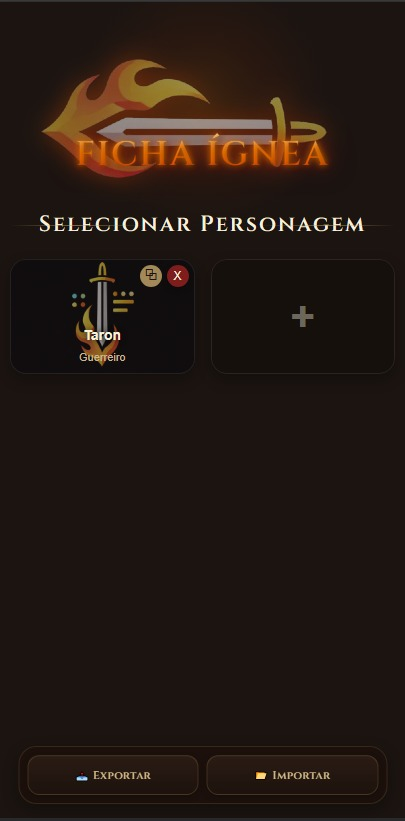
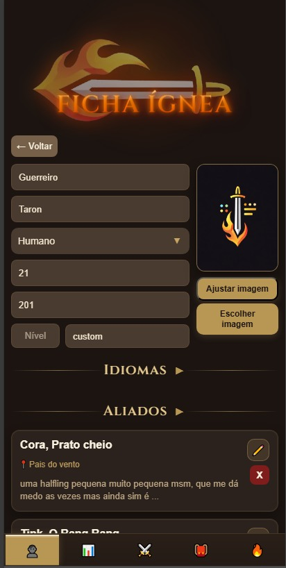
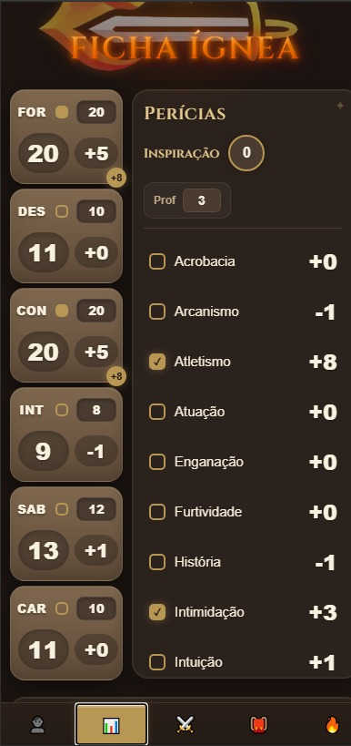
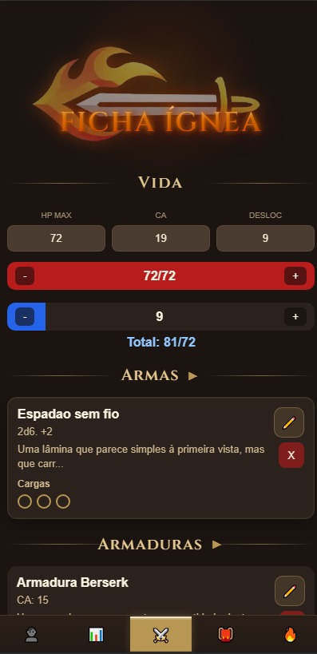
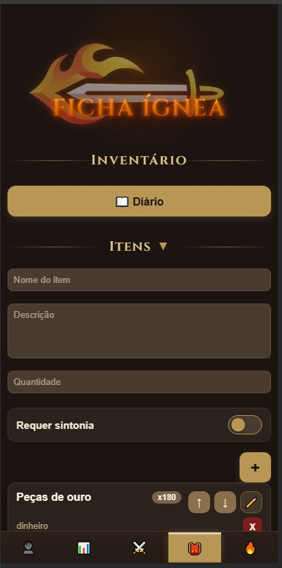
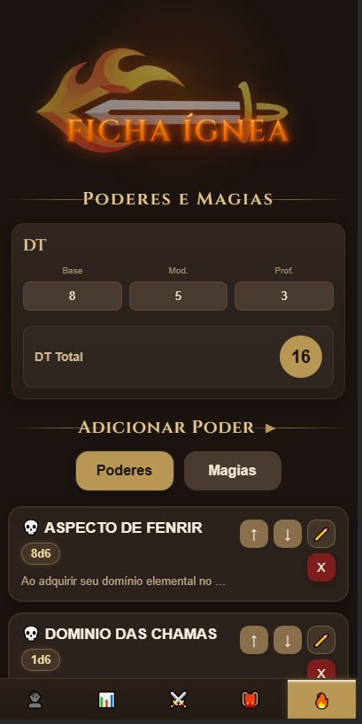

<div align="center">

# 🔥 Ficha Ígnea

**Ficha digital de RPG para D&D 5e — moderna, responsiva e instalável como aplicativo**

[](https://lonnar17.github.io/app-ficha-ignea/)
[](#-pwa--instalação-como-aplicativo)
[](LICENSE)
[](#-tecnologias)

</div>

---

## 📋 Índice

- [Sobre o Projeto](#-sobre-o-projeto)
- [Demo](#-demo)
- [Funcionalidades](#-funcionalidades)
  - [Personagem](#-personagem)
  - [Atributos](#-atributos)
  - [Combate](#-combate)
  - [Inventário](#-inventário)
  - [Poderes e Magias](#-poderes-e-magias)
- [Tecnologias](#-tecnologias)
- [Estrutura do Projeto](#-estrutura-do-projeto)
- [Como Usar](#-como-usar)
  - [Abrir no Navegador](#opção-1-abrir-diretamente-no-navegador)
  - [Servidor Local](#opção-2-servidor-local-recomendado-para-pwa)
  - [Deploy em Hospedagem](#opção-3-deploy-em-hospedagem-estática)
- [PWA — Instalação como Aplicativo](#-pwa--instalação-como-aplicativo)
- [Armazenamento de Dados](#-armazenamento-de-dados)
- [Exportar e Importar Personagens](#-exportar-e-importar-personagens)
- [Roadmap](#-roadmap)
- [Contribuindo](#-contribuindo)
- [Licença](#-licença)
- [Autor](#-autor)

---

## 📖 Sobre o Projeto

O **Ficha Ígnea** nasceu da necessidade de ter uma ficha de personagem D&D 5e completa, organizada e sempre acessível pelo celular — sem depender de papel, caneta ou aplicativos limitados.

O projeto é uma **Progressive Web App (PWA)** 100% client-side: não precisa de servidor, não precisa de banco de dados e funciona completamente offline após o primeiro acesso. Todos os dados do personagem ficam salvos no próprio dispositivo do jogador.

### Por que Ficha Ígnea?

| Problema comum | Solução do Ficha Ígnea |
|---|---|
| Ficha de papel rasga, molha ou se perde | Dados salvos localmente no navegador |
| Apps pagos ou com funcionalidades limitadas | 100% gratuito e open source |
| Interface difícil de usar no celular | Design mobile-first, responsivo |
| Precisa de internet para funcionar | Funciona offline (PWA) |
| Dependência de servidores externos | Sem backend, sem cadastro |

---

## 🚀 Demo

Acesse a versão online sem instalar nada:

**👉 [https://lonnar17.github.io/app-ficha-ignea/](https://lonnar17.github.io/app-ficha-ignea/)**

---

## 📸 Preview

<p align="center">
  
  
  
</p>

<p align="center">
  
  
  
</p>

## ⚙️ Funcionalidades

A ficha é organizada em **5 abas principais**, cada uma cobrindo uma parte fundamental do personagem.

---

### 👤 Personagem

Tudo relacionado à identidade do personagem:

- **Informações básicas** — nome, classe, raça, idade, altura, nível (1–20) e antecedentes
- **12 raças predefinidas** com a opção de criar raças personalizadas
- **Upload de imagem** — envie uma foto ou ilustração do personagem, com editor de posicionamento (pan)
- **Idiomas** — campo livre para listar línguas conhecidas
- **Sistema de Aliados** — adicione NPCs aliados com nome, descrição e localização

---

### 📊 Atributos

Gestão completa das estatísticas do personagem:

- **6 atributos principais** — FOR, DES, CON, INT, SAB, CAR com cálculo automático de modificadores
- **Bônus de proficiência** — ajustável manualmente, usado nos cálculos automáticos
- **Inspiração** — controle de uso de inspiração
- **18 perícias** com toggle de proficiência (o modificador é calculado automaticamente):
  - Acrobacia, Arcanismo, Atletismo, Enganação, Furtividade, História, Intimidação, Intuição, Investigação, Lidar c/ Animais, Medicina, Natureza, Percepção, Persuasão, Prestidigitação, Religião, Sobrevivência, Atuação
- **Salvaguardas** — calculadas automaticamente a partir dos atributos e proficiências
- **Proficiências extras** — campo livre para proficiências de armas, armaduras e ferramentas

---

### ⚔️ Combate

Controle completo da situação de batalha:

- **Sistema de HP** — vida máxima e vida temporária com barra interativa visual
- **CA (Classe de Armadura)** e **Deslocamento**
- **Armas** — cadastre armas com nome, dado de dano (ex: `2d6`), descrição e cargas opcionais
- **Armaduras** — nome, valor de CA, descrição e cargas opcionais
- **Exaustão** — 7 níveis com descrição dos efeitos de cada nível
- **Pontos de Morte** — rastreamento de sucessos e falhas (3 de cada)
- **Pontos de Domínio** — 6 checkboxes configuráveis
- **Resistências** — campo livre para resistências e imunidades

---

### 🎒 Inventário

Gestão de equipamentos e anotações:

- **Itens** — nome, quantidade e descrição para cada item
- **Sistema de Sintonização** — marque itens que exigem sintonização e acompanhe o status
- **Reordenação** — arraste itens para mudar a ordem da lista
- **Edição via popup** — edite qualquer item sem sair da tela
- **Diário integrado** — campo de texto livre para anotar missões, NPCs importantes, segredos descobertos e pontos de trama

---

### 🔥 Poderes e Magias

Sistema completo de habilidades mágicas e especiais:

- **DT (Dificuldade de Teste)** — calculado automaticamente: Base + Modificador + Proficiência
- **Poderes** — habilidades especiais com nome, dado de dano, tipo, descrição e número de usos
- **Magias por círculo (0–9)**:
  - Espaços de magia editáveis por círculo
  - Cada magia: nome, tipo, dano, círculo, tempo de conjuração, alcance, duração, descrição e usos
- **21 tipos de dano** com identificação visual por emoji:

| Tipo | Tipo | Tipo |
|------|------|------|
| 🔥 Fogo | ❄️ Gelo | ⚡ Raio |
| 🌩️ Trovejante | 💀 Necrótico | ✨ Radiante |
| ☠️ Veneno | 💧 Água | 🔮 Mágico |
| 🧠 Psíquico | 🗡️ Corte | 🏹 Perfurante |
| 💥 Concussão | ⚙️ Metal | 👊 Físico |
| 🌬️ Vento | 🪵 Madeira | 🪨 Terra |
| 🌑 Trevas | 🌟 Luz | 👻 Espírito |

---

### 🧠 Sistema Extra: Estilo (Devil Trigger)

Um sistema de combate especial inspirado em **Devil May Cry**:

- **Rank de combate** progressivo: D → C → B → A → S → SS → SSS
- **Bônus crescentes** conforme o rank sobe durante a batalha
- Mecânica de estilo para grupos que gostam de narrativas mais cinematográficas

---

## 🛠️ Tecnologias

O projeto é construído com tecnologias nativas da web — sem frameworks, sem dependências externas, sem processo de build.

| Tecnologia | Uso |
|---|---|
| **HTML5** | Estrutura da aplicação |
| **CSS3** | Estilização (4.900+ linhas customizadas) |
| **JavaScript Vanilla** | Toda a lógica (3.400+ linhas) |
| **localStorage API** | Persistência dos dados no dispositivo |
| **Service Worker** | Cache offline (PWA) |
| **Web App Manifest** | Instalação como aplicativo nativo |
| **Google Fonts** | Tipografia medieval (Cinzel, MedievalSharp) |

> Sem npm, sem build, sem servidor — basta abrir o `index.html`.

---

## 📁 Estrutura do Projeto

```
app-ficha-ignea/
├── index.html        # Estrutura HTML principal com todas as abas
├── script.js         # Toda a lógica da aplicação (~3.400 linhas)
├── style.css         # Estilos completos (~4.900 linhas)
├── sw.js             # Service Worker para cache offline
├── manifest.json     # Configuração do PWA
├── icon-192.png      # Ícone do app (192×192px)
├── icon-511.png      # Ícone do app (511px)
├── icon-512.png      # Ícone do app (512×512px)
└── README.md         # Este arquivo
```

---

## 🖥️ Como Usar

Não há instalação de dependências. Basta ter um navegador moderno.

### Opção 1: Abrir diretamente no navegador

```bash
# Clone o repositório
git clone https://github.com/lonnar17/app-ficha-ignea.git

# Abra o arquivo no navegador
# Linux / macOS
open app-ficha-ignea/index.html

# Ou simplesmente arraste o arquivo index.html para o navegador
```

> **Atenção:** Algumas funcionalidades de PWA (como Service Worker) exigem protocolo `http://` e não funcionam em `file://`. Use a Opção 2 para a experiência completa.

---

### Opção 2: Servidor local (recomendado para PWA)

Escolha uma das formas abaixo:

**Python (já vem no sistema):**
```bash
cd app-ficha-ignea
python -m http.server 8080
# Acesse: http://localhost:8080
```

**Node.js:**
```bash
cd app-ficha-ignea
npx http-server -p 8080
# Acesse: http://localhost:8080
```

**VS Code — extensão Live Server:**
1. Instale a extensão [Live Server](https://marketplace.visualstudio.com/items?itemName=ritwickdey.LiveServer)
2. Clique com o botão direito no `index.html`
3. Selecione **"Open with Live Server"**

---

### Opção 3: Deploy em hospedagem estática

Por ser um projeto de arquivos estáticos, funciona em qualquer CDN ou hospedagem gratuita:

| Plataforma | Comando / Instrução |
|---|---|
| **GitHub Pages** | Ative em *Settings → Pages → Deploy from branch* |
| **Netlify** | Arraste a pasta para [app.netlify.com/drop](https://app.netlify.com/drop) |
| **Vercel** | `npx vercel --prod` |
| **Firebase Hosting** | `firebase deploy` |

---

## 📱 PWA — Instalação como Aplicativo

O Ficha Ígnea pode ser instalado no celular ou computador como um app nativo:

**Android (Chrome):**
1. Acesse o site no Chrome
2. Toque no menu (⋮) → **"Adicionar à tela inicial"**
3. O app aparecerá no launcher como qualquer outro aplicativo

**iOS (Safari):**
1. Acesse o site no Safari
2. Toque no botão de compartilhar (□↑)
3. Selecione **"Adicionar à Tela de Início"**

**Desktop (Chrome/Edge):**
1. Acesse o site
2. Clique no ícone de instalação (⊕) na barra de endereço
3. Confirme a instalação

Após instalado, o app:
- Abre sem barra do navegador (modo standalone)
- **Funciona completamente offline**
- Tem ícone próprio na tela inicial

---

## 💾 Armazenamento de Dados

Todos os dados são salvos automaticamente no **localStorage** do navegador — sem nenhuma ação do usuário.

```
localStorage["personagens"] → Array com todos os personagens (JSON)
```

**O que isso significa na prática:**
- ✅ Dados persistem entre sessões (fechar e abrir o app)
- ✅ Funciona sem internet e sem servidor
- ✅ Dados ficam no seu dispositivo (privacidade total)
- ⚠️ Limpar dados do navegador ou trocar de dispositivo apaga os personagens
- ⚠️ Dados não sincronizam automaticamente entre dispositivos

> **Dica:** Use a função de **Exportar** regularmente para ter um backup dos seus personagens.

---

## 📦 Exportar e Importar Personagens

Para proteger seus dados ou migrar para outro dispositivo:

**Exportar:**
1. Abra o personagem desejado
2. Clique em **Exportar** — um arquivo `.json` será baixado

**Importar:**
1. Clique em **Importar**
2. Selecione o arquivo `.json` exportado anteriormente
3. O personagem será restaurado com todos os dados

**Duplicar personagem:**
- Use a função **Duplicar** para criar uma cópia de um personagem existente (útil para testar builds sem perder o original)

---

## 📌 Roadmap

- [ ] Versão Android nativa (Play Store)
- [ ] Sistema de login e armazenamento na nuvem
- [ ] Compartilhamento de fichas entre jogadores
- [ ] Suporte a outros sistemas de RPG (Pathfinder, Call of Cthulhu, etc.)
- [ ] Sistema de mesa/multiplayer para mestres
- [ ] Tema claro (light mode)
- [ ] Melhorias de acessibilidade

---

## 🤝 Contribuindo

Contribuições são muito bem-vindas! Veja como participar:

```bash
# 1. Faça um fork do repositório
# (Botão "Fork" no GitHub)

# 2. Clone o seu fork
git clone https://github.com/seu-usuario/app-ficha-ignea.git

# 3. Crie uma branch para sua feature
git checkout -b feature/minha-nova-feature

# 4. Faça as alterações e commit
git add .
git commit -m "feat: adiciona minha nova feature"

# 5. Envie para o seu fork
git push origin feature/minha-nova-feature

# 6. Abra um Pull Request no repositório original
```

**Padrão de commits sugerido:**
- `feat:` nova funcionalidade
- `fix:` correção de bug
- `style:` mudanças de CSS/UI sem impacto na lógica
- `refactor:` refatoração de código
- `docs:` atualização de documentação

---

## 📄 Licença

Este projeto está sob a licença **MIT** — você pode usar, modificar e distribuir livremente, desde que mantenha os créditos.

Veja o arquivo [LICENSE](LICENSE) para mais detalhes.

---

## 👨‍💻 Autor

Desenvolvido com ❤️ por **Leonardo**

---

<div align="center">

Se o projeto foi útil para você, considere dar uma ⭐ no repositório e compartilhar com seus amigos de mesa!

</div>
